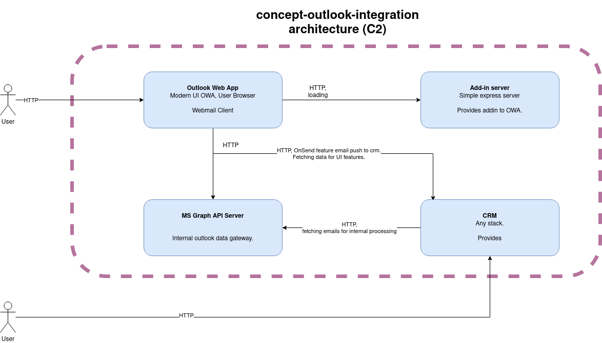

# concept-outlook-integration

Concept of using outlook as webmail client for any kind of CRM. This app demonstrate necessary outlook extensions to achieve the goal.

## Quick Start Guide

1. Add manifset.xml to Outlook Web App. [Instructions](https://learn.microsoft.com/en-us/office/dev/add-ins/outlook/sideload-outlook-add-ins-for-testing?tabs=windows#new-outlook-on-the-web)
2. Start server with command `npm run dev-server`.
3. Enjoy.

## Integration architecture

## Reference
- [Outlook add-in tutorial](https://learn.microsoft.com/en-us/office/dev/add-ins/tutorials/outlook-tutorial)
- [Sideloading in OWA](https://learn.microsoft.com/en-us/office/dev/add-ins/outlook/sideload-outlook-add-ins-for-testing?tabs=windows#new-outlook-on-the-web)
- [OnSend feature description](https://learn.microsoft.com/en-us/office/dev/add-ins/outlook/outlook-on-send-addins?tabs=classic)